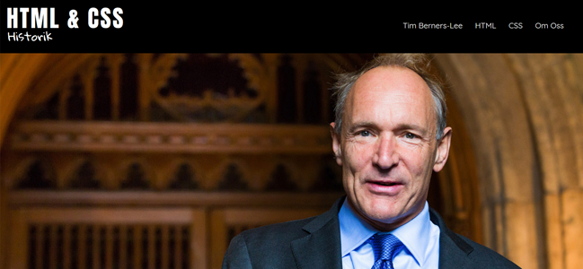

 

This is a group-project I did with a couple of class mates.
 
<a href="https://awkes.github.io/HTML-och-CSS-historik/" target="_blank" style="background: #1a1a1d; color: white; padding: 10px; text-decoration: none; font-size: 1rem; display: inline-block; float : left;">Link to project</a>
<a href="/work" style="height: 40px; color: black; font-size: 4rem; text-decoration: none; display: block; float: right; line-height: 30px">&#8604;</a>

